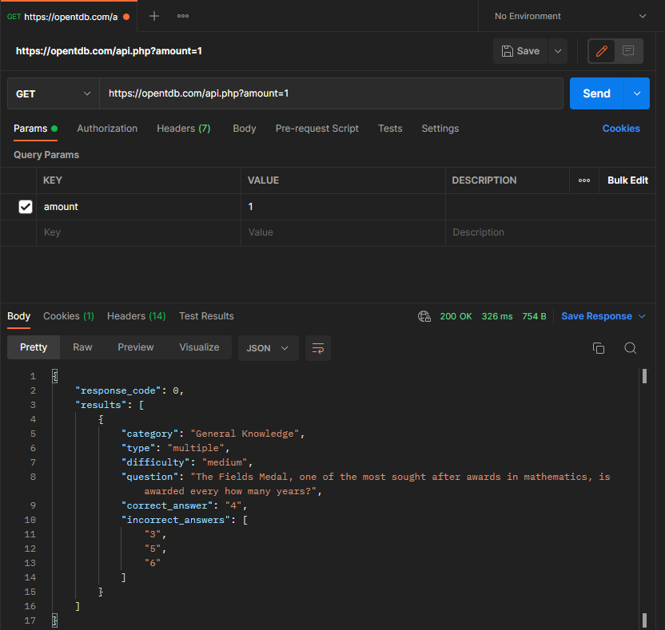
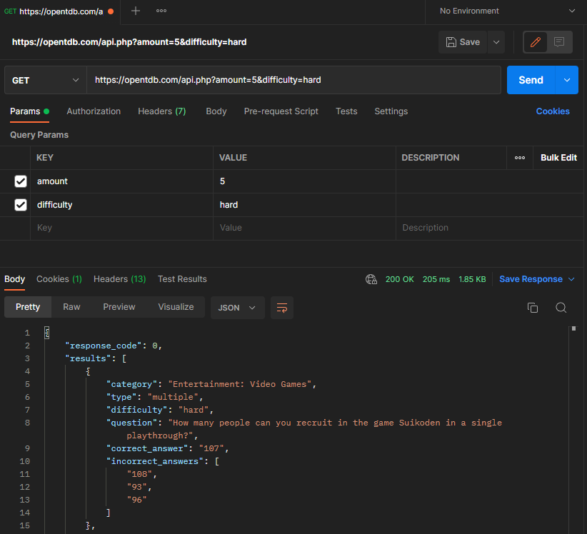
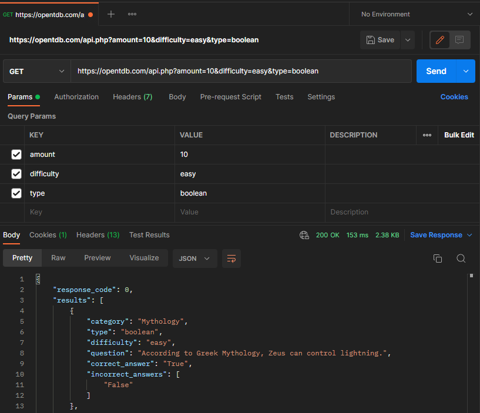
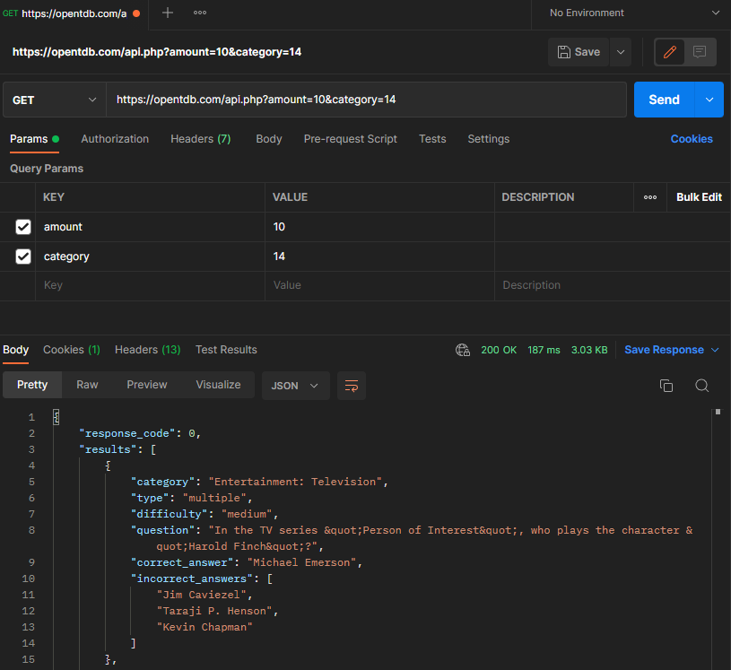
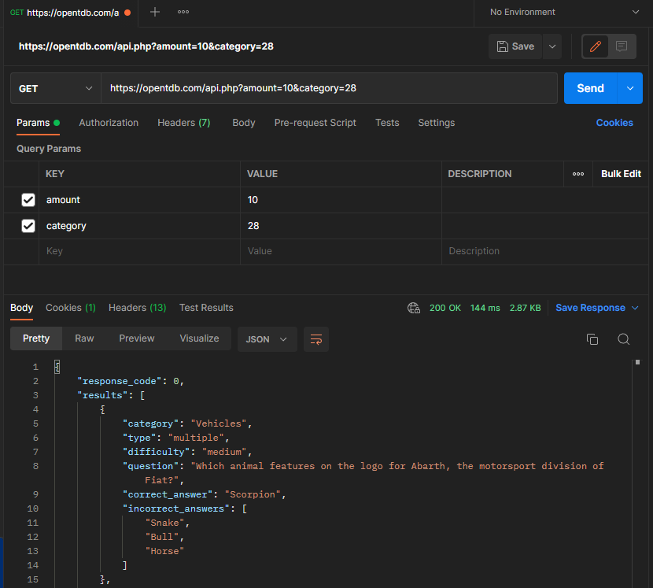

# Open Trivia Database Documentation
The Open Trivia Database Api provides questions to the user based on the specifications given in the Api calls.  The Api is controlled through different paramters as shown below, and gives to the user a set of questions that fulfils the paramters given in the URL.

## Amount Parameter
The amount parameter signals to the server how many questions that the user would like to recieve.  This can be any number between 1 and 50.

> https://opentdb.com/api.php?amount=1

This Api call signals to the server that the user would like one question with no specifications, therefore the given quesiton will be chosen from any of the available questions.

## Difficulty Parameter
The difficulty parameter tells the server what difficulty of questions that the user would like.  The user can chose from "easy", "medium", or "hard" to recieve questions from the respective difficulty.

> https://opentdb.com/api.php?amount=5&difficulty=hard

This Api call signals to the user than the user would like 5 questions with a hard difficulty.

## Type Parameter
The type parameter signals to the server what kinds of questions that the user would like to recieve.  The user can input "boolean" to recieve true/false questions or "multiple" to recieve multiple choice questions.

> https://opentdb.com/api.php?amount=10&difficulty=easy&type=boolean

This Api call signals to the server that the user would like 10 questions with an easy difficulty based on the "difficulty" parameter, and that the user would also like a true/false question based on the "type" paramter being boolean.

## Category Parameter
The category parameter indicates to the server what category to select the questions from.  The number can be between 1 adn 32, and each of the numbers represents a different category as defined in the documentation(https://opentdb.com/api_config.php).

> https://opentdb.com/api.php?amount=10&category=14

This Api call signals to the server what category the user would like to recieve the 10 questions from, the parameter "category" of 14 signals to the user that the category the questions are take from have to do with entertainment.

> https://opentdb.com/api.php?amount=10&category=28

In this Api call we change the "category" to 28, this means that we will only recieve questions from the vehicles category.
